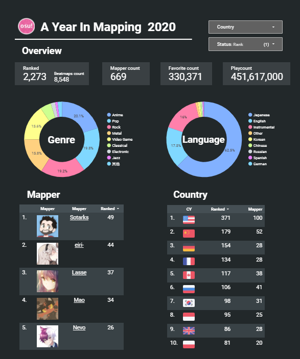

# A Year In Mapping 2020  
視覺化統計2020年，osu!std所有ranked及loved圖相關數據。  

[論壇連結](https://osu.ppy.sh/community/forums/topics/1213530) | [視覺化連結](https://datastudio.google.com/s/jIrztqsZvwM)  

## 為什麼要做這個？
主要希望藉由統計數據來看看華人2020年在這遊戲中的的活耀程度，以及看看有那些新加入的mapper。  
但實際統計下來也順道統計了許多有趣的數據，比如天文數字般的遊玩次數、各國及個人的貢獻排行、哪些歌曲最受歡迎、類型分布等等  

## 相關連結
* [osu!API](https://github.com/ppy/osu-api/wiki)  
* [my osu! profile](https://osu.ppy.sh/users/4470854)  
